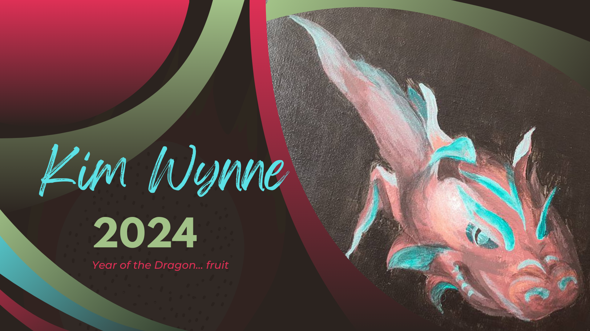
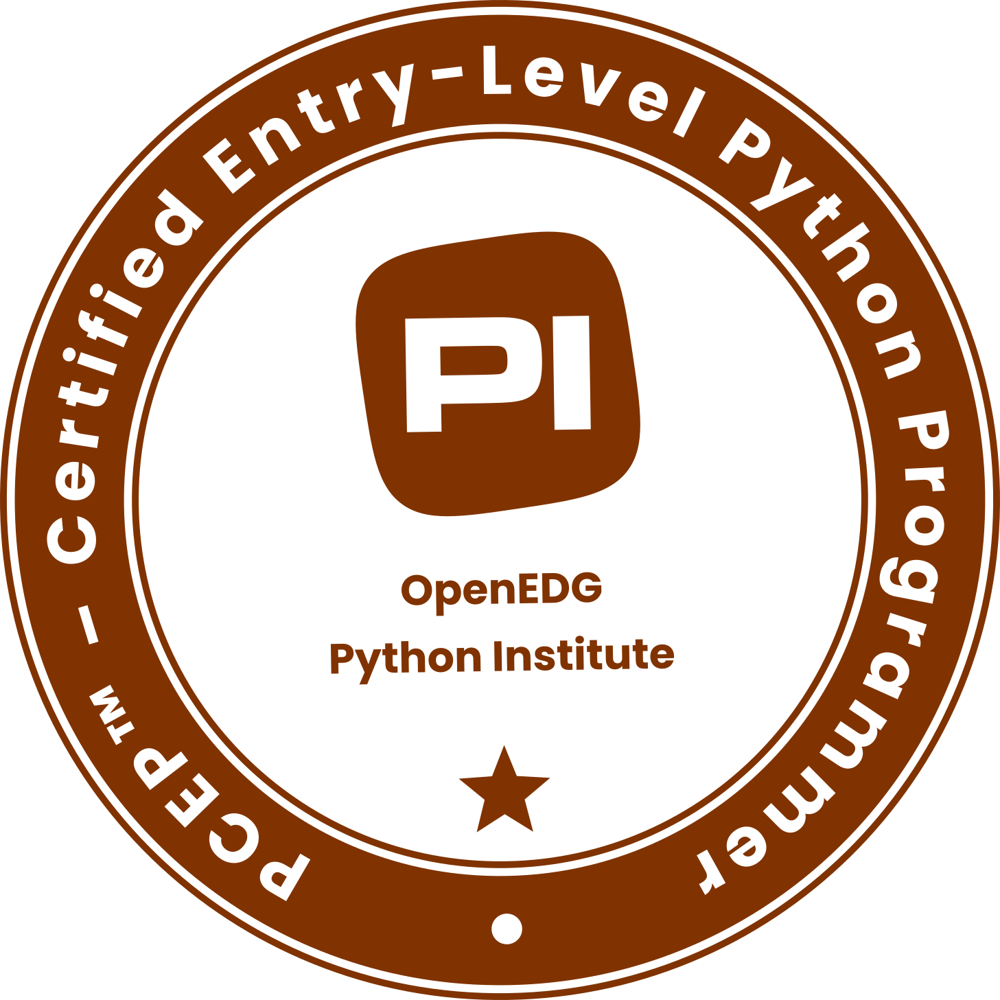

### Hi there, I'm Kimberly Wynne 👋
## AI Engineer/Human Artist

## About Me
- 🔭 I'm currently working on my Doctor's Note Summarizer project
- 🌱 In the process of obtaining 2 additional certifications: one as a Python Programmer and another as an OCI Generative AI Professional
- 👯 Looking to collaborate on my next 2 projects: Winging it Wisely and In/Out-of-Office Display
- 🤔 Always looking for help with finding my keys, phone, wallet, and glasses
- 💬 Ask me about the benefits of eating slowly and keeping a daily journal
- 📫 How to reach me: [LinkedIn](https://www.linkedin.com/in/kimberlywynne/)
- 😄 Pronouns: she/her/hers
- ⚡ Fun fact: I painted that dragon fruit (above) with traditional acrylic paint in Dec 2017

## My Values in AI
- ✨ Affirmative consent
- ✨ Shared understanding and transparency
- ✨ Continuous safety and trust
- ✨ Proactive sustainable futurism
- ✨ Growth mindset and curiosity

## Certifications

PCEP – Certified Entry-Level Python Programmer